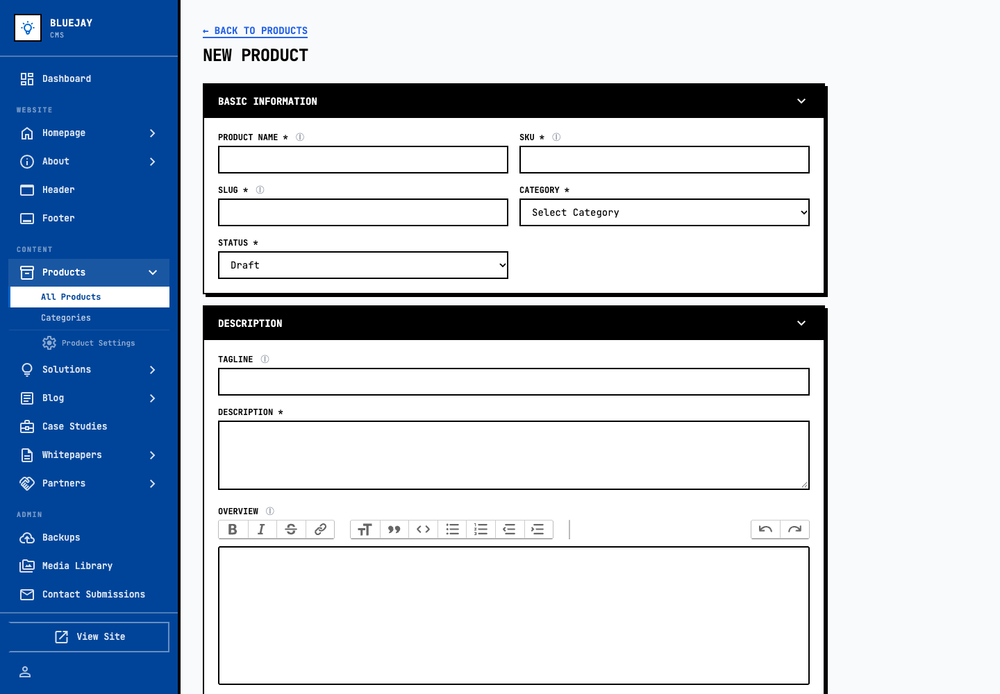
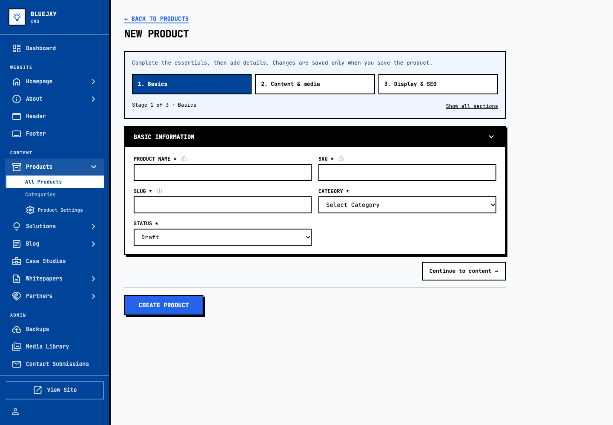
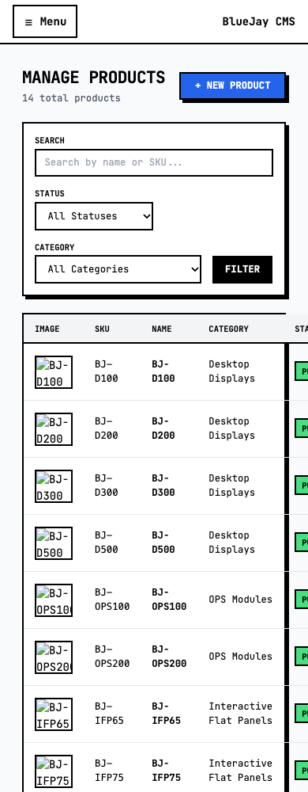
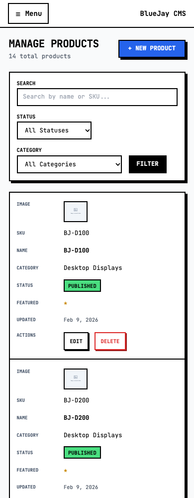
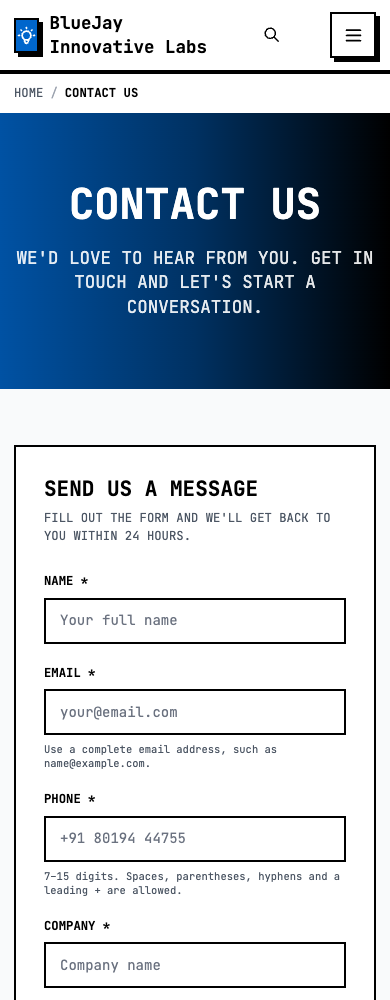
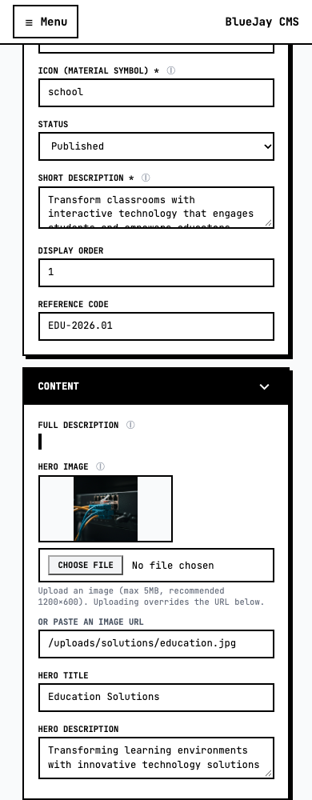
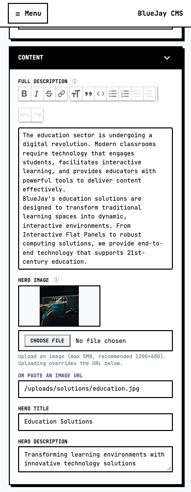
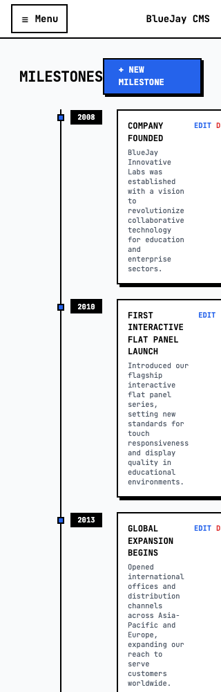
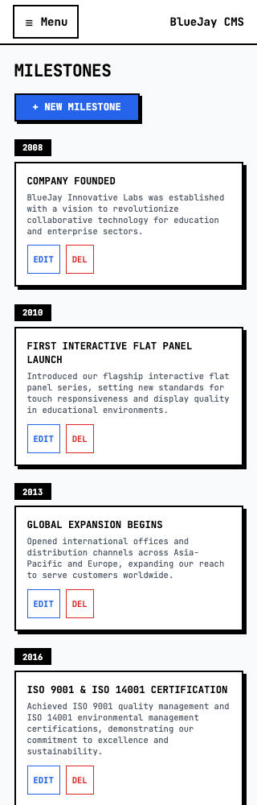

# BlueJay UI/UX review and implementation report

**Branch:** `codex/ui-ux-review-20260929` · **Baseline:** `dd1d30d` · **Date:** 29 September 2026

Implementation and verification are complete; the branch is ready for review. Merge and production deployment have not been performed.

## What changed

The work preserves the existing visual identity and server-rendered CMS. It addresses task completion, responsive layouts, accessible controls, editing reliability and restrained interaction polish.

| Finding | Implemented improvement | Verification |
|---|---|---|
| Product creation mixes essentials, content and optional settings | Three navigable stages, clear progress, show-all option, one save operation | Create/edit/save/reload; hidden-stage validation; rich text and selected-file retention; duplicate recovery |
| Mobile admin lists hide actions horizontally | Labelled, semantic records at compact widths; desktop tables retained | Five viewport widths, visible edit/delete controls, long content |
| Header settings and switches are cramped or misleading | Stacked mobile fields; checkbox appearance follows real checked state | Keyboard toggle and save/reload, layout evidence |
| Numerous admin fields lack accessible names | Explicit label associations, labelled repeated controls, named public filters | Form-name and duplicate-ID scans; axe checks |
| Contact form follows three office maps on phones | Form-first document order; desktop office/form columns retained | Visual and DOM-order checks; invalid/valid submissions |
| Untouched whitepapers appear unsaved | Compare browser-normalized color defaults | Initial clean, edit dirty, revert clean |
| Sidebar highlights parent and child destinations | Select the most specific matching route | Settings-page active marker assertion |
| Invalid source images show browser broken-image artifacts | Accessible, consistent unavailable-image fallback | Failed image decoding coverage; source files preserved |
| Keyboard navigation has no direct content entry | Skip links and visible focus; one public main landmark | Keyboard focus assertions |
| Mobile drawer does not isolate background | Modal semantics, background inertness, focus return and breakpoint reset | Keyboard, Escape and resize checks |
| New transitions need visual inspection and reduced-motion support | Stage/menu transitions and opaque search-panel movement at 180ms | Five slow frames per transition, then five final frames; reduced-motion and rapid-click tests |
| Product-detail actions require hover and have cryptic names | Persistent named controls with 44px targets | HTMX specification add/edit, mobile screenshot |
| Long product breadcrumbs force horizontal overflow | Wrapping breadcrumbs and robust text wrapping | 320px extreme-name test |
| Testimonial selectors are unnamed and tiny | Named, numbered 44px selectors with pressed state | Pointer/keyboard-accessible controls; selection assertion |
| Metadata and sidebar text have weak contrast | Darker/lighter appropriate text and badge colors | Automated contrast verification |
| Downloads expose raw byte counts and duplicated version prefix | Human-readable sizes, clear version labels, persistent download icon | Rendered product detail and existing format helper |
| Solution full-description editor is not initialized | Load existing Trix integration; preserve HTML; usable textarea fallback | Real edit/save/reload and source restoration |
| Tiny screens crush milestones and clip editor controls | Compact milestone cards, wrapped toolbars and detail navigation | 320px and tablet rechecks |
| Failed HTMX requests provide inadequate recovery feedback | Inline retry guidance without clearing entries; clear on success | Simulated HTTP 500 and successful retry |
| Case-study action row clips Cancel at 320px | Wrap save/preview/cancel actions | Targeted five-width regression |
| Rich-text Undo changes serialized HTML and falsely remains dirty | Restore saved HTML when the original text-and-formatting document is restored | Five focused edit/Undo/Redo/formatting checks |
| Malformed persisted sidebar state can prevent navigation initialization | Validate stored state before use | Null, array and invalid-JSON recovery checks |

## Measured before and after

These are browser geometry measurements in the local fixture, not estimates of user task time.

| Scenario | Before | After |
|---|---:|---:|
| New product form visible height at 1440px | 1,165px | 638px (45% smaller initial view) |
| Product save button top at 1440px | 1,237px, below viewport | 694px, inside viewport |
| First product Edit link at 390px | x=636–686px, outside viewport | x=128–178px, inside viewport |
| First contact field top at 390px | 3,867px | 598px |
| Solution editor registered / editable | No / No | Yes / Yes |
| Extreme product page width at 320px | 944px | 320px |

Splitting every admin screen would add navigation without established benefit. The new stages are limited to the product form. Editors can jump between stages, use “Show all sections”, and save from any stage. Validation reveals and focuses an invalid field even when it belongs to another stage. Values stay in the same form; no new autosave or publication semantics were introduced.

## Visual comparisons

Open [the side-by-side gallery](gallery.html) for larger images, including animation timelines.

### Product editor

| Before | After |
|---|---|
|  |  |

### Mobile product records

| Before | After |
|---|---|
|  |  |

### Contact flow on phones

| Before | After |
|---|---|
|  |  |

### Solution description editor

| Before | After |
|---|---|
|  |  |

### Milestones at 320px

| Before | After |
|---|---|
|  |  |

## Animation verification

New motion was first implemented at **1,600ms**. Each of the product-stage, mobile-navigation and search-panel transitions was paused at 0, 400, 800, 1,200 and 1,600ms for screenshots and geometry checks. Inspection caught page content showing through a fading search panel. The panel now stays opaque throughout its 4px movement. Scroll anchoring was also disabled in the admin scrolling region, and the final sampled stage frames retain a stable scroll position.

After correction and slow-frame inspection, duration was reduced to **180ms** and captured again at 0, 45, 90, 135 and 180ms. All three measured durations were 180ms. Reduced motion suppresses transitions, including when the preference changes during an animation. Rapid stage changes leave one visible panel and one current marker. [Slow frame measurements](evidence/animation-slow.json) · [Final frame measurements](evidence/animation-final.json).

## Test results

Final results are recorded in [verification.json](evidence/verification.json). The repeatable browser workflows live in `tests/browser/ui-ux-readiness.js` and `tests/browser/ui-ux-edge-cases.js` and refuse non-local hosts.

- Baseline: 66 routes at desktop and phone widths, **132 combinations**.
- Expanded visual/layout matrix: the same 66 routes at **320, 390, 768, 1024 and 1440px**, **330 combinations**. **25 final focused checks passed** after repairing the remaining 320px case-study action-row overflow. The off-screen inactive homepage carousel and visually clipped table headers are intentional exclusions from the overflow detector.
- **37 end-to-end assertions:** product creation, publication, saved preview, edit persistence, in-memory file selection, SEO limits, duplicate conflict preservation, specification add/edit, failed detail request recovery, deletion, color dirty-state behavior, navigation, header save and contact validation/submission.
- **27 edge-case assertions:** skip links, mobile menu and search focus restoration, testimonials, modal drawer isolation, breakpoint reset, reduced motion, rapid interaction, solution editor save/reload, failed enquiry retry, a separately closed no-JavaScript browser context, and malformed persisted navigation state.
- **16 focused browser assertions:** 11 form-recovery checks and five rich-editor dirty-state checks. The old rich-editor test failed on the baseline because it replaced rich HTML with plain text. It now tests actual Undo/Redo; the separately reproduced normalization bug was fixed.
- **32 axe scans with zero reported violations** across 16 representative routes at desktop and phone widths, using WCAG 2 A/AA and 2.1 AA rule tags.
- Source-package Go tests, including the existing Go end-to-end suite; seven existing JavaScript tests; CSS build; JavaScript syntax checks and diff whitespace checks.

The root `go test ./...` command encounters pre-existing, untracked security-review Go probes with conflicting packages and duplicate `main` functions. Those files were preserved. Testing was therefore scoped to all actual application packages: `go test -count=1 ./cmd/... ./internal/... ./db/...`.

## Scope and release notes

All writes used a disposable copy of the local database. Synthetic product fixtures were removed; modified header settings and solution HTML were restored. Neither the original database nor production was changed. The task-owned headless browser and all three local servers were closed; no task test ports remain listening. No database migrations or dependency upgrades were added.

Some checked-in seed media are SVG or HTML bytes stored under JPEG filenames. The UI now handles these cleanly; it does not invent replacement product photography. Real production media should be checked as part of editorial release review. The source files were intentionally preserved.

Verification used headless Chromium on macOS. Automated checks and keyboard tests do not establish complete WCAG conformance, screen-reader compatibility, Safari/iOS behavior, or every possible CRUD permutation. The report distinguishes route rendering from exercised mutation workflows.

Guidance used: [WAI multi-page forms](https://www.w3.org/WAI/tutorials/forms/multi-page/), [WCAG reflow](https://www.w3.org/WAI/WCAG21/Understanding/reflow/), and [reduced-motion technique C39](https://www.w3.org/WAI/WCAG21/Techniques/css/C39).

The [implementation tracker](TRACKER.md) records each finding and its final evidence. Merge to main and production deployment remain reserved for the user's approval.
